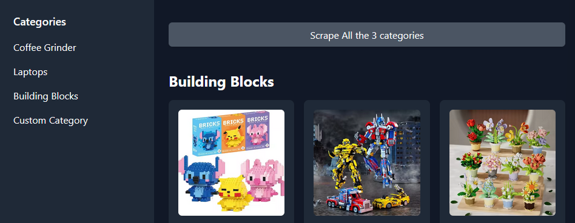
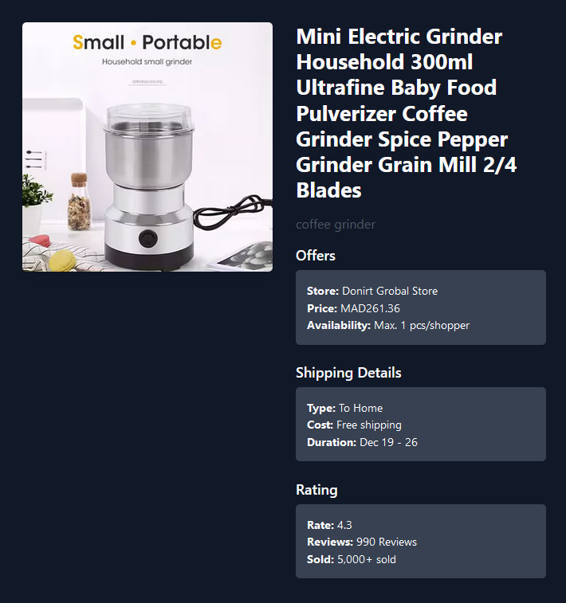
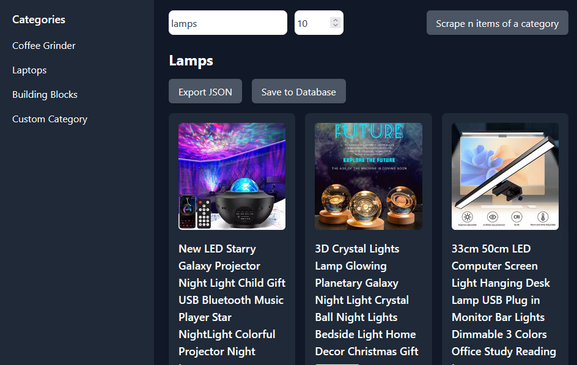

# Ali Express Scraper

This is AliExpress scraper that:

1- Scrape from 3 categories:

- Coffee Grinder
- Laptops
- Building Blocks



You have the possibility to scrape the first 2 pages of the three categories -they are automatically saved in the database-, and then render each on of them in their corresponding section (It takes a long time).

You'll get something like that in the console:

```bash
Scraping laptops...
Scraping started...
Scraping completed! 120 products found.
Scraping building blocks...
Scraping started...
```

Product Page:



2- Scrape custom categories:

In the Custom Category Tab, you can scrape whatever category you want by inserting the category name and the number of items you want to retrieve.

You can export generated data as a JSON format, or save it to your mongoDB database. Check the [JSON file](./products.json) for an example.



## The data scraped

- [x] Name
- [x] Price
- [x] Image URL
- [x] Article URL
- [x] Shipping:
  - [x] Shipping Price
  - [x] Shipping Time
- [x] Store Name
- [x] Availability / Number of Items you can purchase
- [x] Rating
  - [x] Number of Reviews
  - [x] Rating number out of 5
  - [x] Number of Items Sold

## To-Do

- [ ] Find a better solution for the `I'am not a robot` checkbox.

## Project Setup

Follow these steps to set up and run the project locally:

### Client

1- Navigate to the `client` directory:

```bash
cd client
```

2- Install dependencies:

```bash
npm install
```

3- Start the server

```bash
npm start
```

### Server

1- Navigate to the server directory:

```bash
cd server
```

2- Add a `.env` file with the following variables:

```bash
MONGO_USER=<your_mongo_user>
MONGO_PASSWORD=<your_mongo_password>
MONGO_PATH=<your_mongo_path>
PORT=<your_port>
```

3- Install dependencies:

```bash
npm install
```

4- Start the server:

```bash
npm run dev
```
